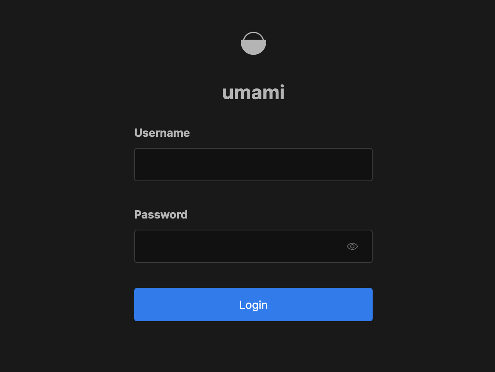
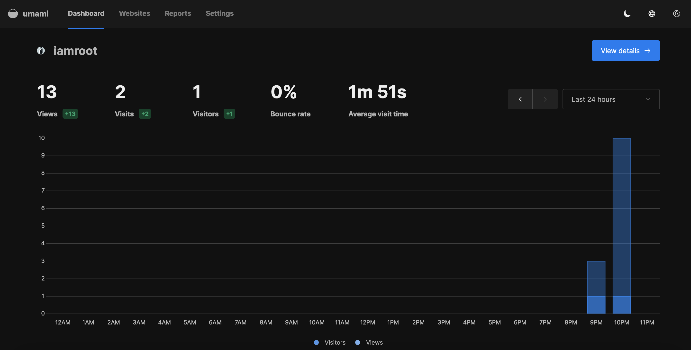

# How to install Umami for Website Analytics on Linux

Umami is a privacy-centric web analytics tool that offers an alternative to services like Google Analytics. It tracks website traffic and user behavior without using cookies, anonymizing all data to ensure GDPR, CCPA, and PECR compliance. 

It offers a simple dashboard for metrics such as page views and visitor counts, and can be self-hosted or cloud-based, appealing to developers and website owners looking for a lightweight analytics solution.

In this guide, you will learn how to run umami on Linux using Docker/Podman.

## Requirements

- Server / VM / Computer / Raspberry Pi
- Installed Linux Operating System (Debian, Rocky, ...)
- Container Runtime (Docker / Podman) and docker/podman-compose

## Installation

First you have to clone the GitHub repository of Umami:
```shell
git clone https://github.com/umami-software/umami.git
```

Change into the directory of the cloned repository and start up the docker/podman compose deployment:
```shell
cd umami
podman compose up -d
```

Check if the containers are up and running:
```shell
podman ps

224dea447469  docker.io/library/postgres:15-alpine            postgres           3 days ago  Up About an hour (healthy)                          umami_db_1
c1d246e8e0e7  ghcr.io/umami-software/umami:postgresql-latest  yarn start-docker  3 days ago  Up About an hour (healthy)  0.0.0.0:3000->3000/tcp  umami_umami_1
```

If you run the containers as a normal user (rootless), make sure to enable lingering, otherwise the containers will be stopped when the user session is terminated:
```shell
loginctl enable-linger $UID
```

**Umami** should now be reachable via port **3000**. Go to the browser of your choice and enter `http://<linux-ip>:3000` and you should be presented with the **Umami** login screen:


The default user is `admin` and the password `umami`. Login and make sure to **change the password** to something secure.

## Reverse Proxy

To make Umami really usable you probably need to setup a reverse proxy in front of it, so you can have a proper URL like **analytics.yourdomain.com**.

In this case we are using nginx as the reverse proxy.

Install and start nginx like this:
```shell
# rhel based systems
sudo dnf install nginx

# debian based systems
sudo apt install nginx

# Start and enable nginx
sudo systemctl enable nginx --now
```

Now you should see the default nginx site if you visit `http://<linux-ip>`.

Create a simple nginx configuration file for **Umami** like this:
```shell
sudo vim /etc/nginx/conf.d/umami.conf

server {
    listen       80;
    listen       [::]:80;
    server_name  analytics.yourdomain.com;
    proxy_pass   http://localhost:3000;
}
```

Test the nginx config and reload it:
```shell
sudo nginx -t
sudo nginx -s reload
```

Go to your DNS and point the `analytics.yourdomain.com` to the IP of your Linux server / public IP.

Umami should then be reachable over `http://analytics.yourdomain.com`.

Of course you should implement HTTPS using [cerbot / Lets Encrypt](https://certbot.eff.org/).

Short guide for setting up HTTPS:
```shell
# rhel based systems
sudo dnf install certbot

# debian based systems
sudo apt install certbot

# Request certificate for umami
certbot --nginx -d analytics.yourdomain.com
```

Now your **Umami** instance should be secure and reachable via `https://analytics.yourdomain.com`.

## Getting Analytics Data

Now that your Umami instance is up and running you probably want to get some website analytics in there.

- Go to `https://analytics.yourdomain.com/settings/websites`and click on **Add Website**
- Enter the name and domain of the website you want to get analytics for like this
  - Name: Web
  - Domain: web.yourdomain.com
- Click on the Edit button next to the created website
- Go to the **Tracking code** tab and copy the code that should look like this:
  - `<script defer src="https://analytics.yourdomain.com/script.js" data-website-id="d7b590bc-3e6b-493b-9a31-d8d79c10b3f0"></script>`
- Add the code to the default `<head>` section of your website

After someone visits your website now, metrics should show up on your **Umami** instance like this:


This concludes the guide. For further details about **Umami**, visit the official documentation [here](https://umami.is/docs).
